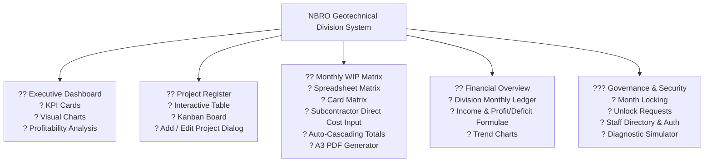
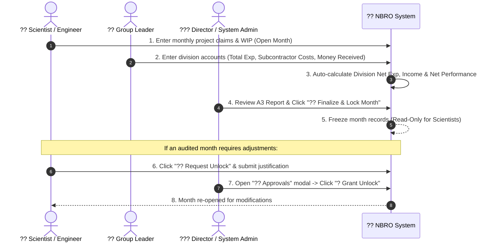

# National Building Research Institute (NBRI)
## Geotechnical Engineering Division (GED) ? Project Register & Progress Management System
### Comprehensive Technical Documentation & Implementation Reference

---

## 1. System Overview & Architecture

The **NBRO Project Register** is an enterprise-grade, zero-latency executive dashboard and project management system developed for the Geotechnical Engineering Division of NBRO.

The system combines:
1. **Zero-Latency In-Memory Execution**: Instant initial boot using bundled seed databases (`BUNDLED_DATABASE`), with local storage caching (`nbri_cached_bootstrap`).
2. **Real-Time Central Database Synchronization**: Asynchronous background bi-directional sync with Google Sheets backend via Google Apps Script web endpoints.
3. **Role-Based Access Control (RBAC)**: Secure multi-tier permissions covering System Admin, Director, Managers, Scientists/Editors, and Read-Only Viewers.
4. **Institutional Month-Locking Governance**: Automated freeze states for finalized months with change-request approval workflows.
5. **A3 Landscape Vector PDF Reporting**: Dynamic generation of official NBRO Division Monthly Progress Reports in print-ready vector format.
6. **System Admin Diagnostic Impersonation**: Live shadow simulation enabling System Admins to diagnose permissions and UI states as any role or user.

---

## 2. Core Functional Modules

---

## 3. Role & Permission Architecture

| Role | Target Persona | Key Capabilities |
| :--- | :--- | :--- |
| ?? **System Admin** | Mr. Ranjan Weerasinghe | ? Full technical control over all features, databases, and users. ? Password resets & staff role assignment. ? Diagnostic Role & Staff Impersonation. ? Emergency Month Lock/Unlock Overrides. |
| ??? **Director** | Dr. Sanchitha Jayakody | ? Executive oversight of division progress. ? Full edit freedom on all projects and financials at all times. ? Sole authority to formally Finalize & Lock completed months. ? Reviews and approves/rejects scientist unlock requests. |
| ?? **Group Leader / Manager** | Senior Scientists / Group Leads (e.g. Mr. Suranga) | ? Project progress entry for team members. ? Division financial entry (Total Expenditure, Subcontractor Payment, Money Received, Outstanding). ? Group-level filtering and progress tracking. |
| ?? **Scientist / Editor** | Project Engineers (e.g. Ms. Gayathri) | ? Enter Physical % and Financial WIP for assigned projects during **Open** months. ? View baseline totals and project scopes. ? Submit **Unlock Requests** with justification for locked months. |
| ??? **Viewer** | Auditors / Guests | ? Read-only access to dashboard, project records, and reports. |

---

## 4. Month Governance & Locking Workflow

---

## 5. Financial Calculation & Accounting Model

The system utilizes an audit-compliant engineering consultancy accounting model:

1. **Division Net In-House Operating Expenditure**:
   $$\text{Division Net Expenditure} = \text{Total Expenditure} - \text{Subcontractor Payment}$$

2. **Project Financial WIP (`w.financial`)**:
   $$\text{Monthly Working Progress} = \text{Financial claim entered for selected month}$$

3. **Project Total Cumulative (`totCum`)**:
   $$\text{Total Cumulative} = \text{Previous Cumulative Baseline} + \text{Selected Month Working Progress}$$

4. **Division Working Progress**:
   $$\text{Division Working Progress} = \sum_{\text{Active Projects}} \text{Monthly Working Progress}$$

5. **Division Income**:
   $$\text{Income} = \begin{cases} \text{Working Progress} & \text{if } \text{Working Progress} > 0 \\ \text{Money Received} + \text{Outstanding} & \text{otherwise} \end{cases}$$

6. **Project Income**:
   $$\text{Project Income} = \text{Income} - \text{Money Received}$$

7. **Net Monthly Performance (Profit / Operating Deficit)**:
   $$\text{Net Balance} = \text{Income} - \text{Total Expenditure} - \text{Interdivisional}$$
   $$\text{Performance Margin \%} = \frac{\text{Net Balance}}{\text{Income}} \times 100$$
   - **Positive Balance**: Displays as `XX.X% Profit Margin` (Green Badge).
   - **Negative Balance**: Displays as `(XX.X% Operating Deficit)` (Soft Rose Badge).

8. **Auto-Cascading Sync**:
   Whenever any project row is saved, all division financial totals for that month (`Total Expenditure`, `Subcontractor Payment`, `Division Expenditure`, `Income`, `Profit/Deficit`) are recalculated and synchronized to the central database automatically in the background.

---

## 6. Official A3 Landscape Division Progress Report

- **Format**: Standard **A3 Landscape** (`@page { size: A3 landscape; margin: 8mm 10mm; }`).
- **Typography & Theme**: Clean executive styling using Google Inter fonts, dark slate structural headers (`#0f172a`), subtle color shading (peach for baseline, blue for monthly, mint for cumulatives).
- **Structure**:
  - **Header Left**: Institutional title & reporting month name.
  - **Header Right**: 2-Column Division Financial Summary Grid:
    - `Total Expenditure` | `Money Received`
    - `Subcontract Payment` | `Outstanding`
    - `Division Expenditure` | `Interdivisional`
    - `Working Progress` | `Monthly Performance Margin` (`% Margin` or `(% Deficit)`)
    - `Income` | `Project Income`
    - `Net Profit / (Deficit)`
  - **11-Column Matrix Table**: `No`, `Description`, `Client`, `Estimate (Without Tax)`, `Total Cumulative up to Prev Year`, `Advance Received (Current Year) - Without Tax`, `Advance Date`, `<Selected Month>`, `Cumulative Current Year`, `Total Cumulative Current Year`, `Project Engineer`.
  - **Summary Footer**: Automated column totals bar.
- **Export Options**: 1-Click vector print and direct PDF download.

---

## 7. Version History & Checkpoints

| Version | Release Date | Summary of Implementations |
| :--- | :--- | :--- |
| **`v9.2.0`** | 2026-09-02 | **Subcontractor Payments & Deficit Engine**: Added explicit input for Subcontractor direct costs, auto-computed Division Net Exp, refined accounting terminology (`Net Operating Deficit`), and updated A3 PDF summary box. |
| **`v9.1.0`** | 2026-09-02 | **Diagnostic Simulation & Role Impersonation**: Added top bar role switcher (`?? View As...`), user-level simulation (`??? Test As`), and persistent diagnostic testing banner. |
| **`v9.0.0`** | 2026-09-02 | **Institutional Month Locking & Approvals**: Added Month Lock Banner, Director 1-click finalize/unlock toggle, and `?? Approvals` governance center. |
| **`v8.9.0`** | 2026-09-01 | **Enterprise Professional Terminology & Auto-Sync**: Replaced raw sheet text with professional enterprise wording; added auto-cascading division financial summary sync. |
| **`v8.8.0`** | 2026-09-01 | **Modernized Executive A3 Landscape PDF Export**: Upgraded A3 report with executive styling, balanced columns, and clean KPI summary grid. |
| **`v8.7.0`** | 2026-09-01 | **Initial A3 Landscape PDF Export Engine**: Added `?? Export A3 PDF` button and print stylesheet. |

---

## 8. Backup & Rollback Protocol

Stable backup `.zip` archives are stored locally in the project root:
- `NBRO_ProjectRegister_v9.2.0_STABLE.zip`
- `NBRO_ProjectRegister_v9.1.0_STABLE.zip`
- `NBRO_ProjectRegister_v9.0.0_STABLE.zip`

### To Roll Back:
1. Check the desired version tag in `CHANGELOG.md`.
2. Ensure `CACHE_VERSION` in `app.js` matches the tag.
3. Update `<link>` and `<script>` query strings in `index.html`.
4. Hard reload browser with `Ctrl + Shift + R` (or `Ctrl + F5`).
